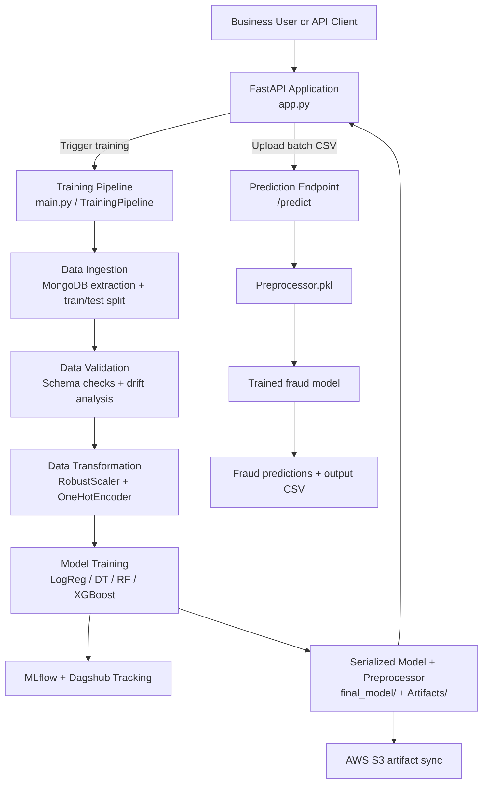
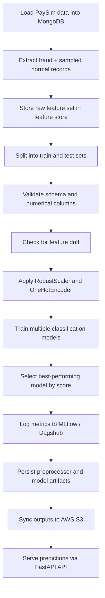

# PaySim MLOps Architecture

An end-to-end MLOps fraud detection solution for mobile money transactions, built around the PaySim synthetic dataset. The project demonstrates a production-oriented machine learning pipeline that ingests transaction data from MongoDB, validates data quality, transforms features, trains and evaluates multiple classifiers, tracks experiments with MLflow and Dagshub, exposes predictions through a FastAPI service, and packages the application with Docker and GitHub Actions.

## Overview

This repository focuses on detecting fraudulent transactions in mobile money networks with a practical ML pipeline, not just a notebook experiment. It combines:

- MongoDB-based data storage for large-scale transaction data
- Data validation and drift checks using the schema and statistical analysis
- Feature engineering with preprocessing pipelines for numeric and categorical variables
- Model benchmarking across logistic regression, decision tree, random forest, and XGBoost
- Experiment tracking with MLflow and Dagshub
- Deployment-ready FastAPI inference service
- Artifact and model syncing to AWS S3
- Containerized delivery through Docker and GitHub Actions

## Business Problem

Financial fraud detection requires distinguishing malicious transfers from legitimate transactions while handling class imbalance, noisy features, and strict operational constraints. This project models the fraud detection task on the PaySim dataset and operationalizes the full lifecycle from ingestion to inference.

## Architecture



## Workflow



## Project Structure

```text
PaySimMLOpsArchitecture/
├── .github/
│   └── workflows/
│       └── main.yml
├── .dvc/
│   ├── .gitignore
│   └── config
├── data_schema/
│   └── schema.yaml
├── final_model/
│   ├── model.pkl
│   └── preprocessor.pkl
├── fraud_detection/
│   ├── cloud/
│   │   └── s3_syncer.py
│   ├── components/
│   │   ├── data_ingestion.py
│   │   ├── data_transformation.py
│   │   ├── data_validation.py
│   │   └── model_trainer.py
│   ├── constant/
│   │   └── training_pipeline/
│   │       └── __init__.py
│   ├── entity/
│   │   ├── artifact_entity.py
│   │   └── config_entity.py
│   ├── exception/
│   │   └── exception.py
│   ├── logging/
│   │   └── logger.py
│   ├── pipeline/
│   │   └── training_pipeline.py
│   ├── utils/
│   │   ├── main_utils/
│   │   └── ml_utils/
│   └── __init__.py
├── templates/
│   └── table.html
├── transactions_data/
│   └── data.csv.dvc
├── .dockerignore
├── .dvcignore
├── .gitignore
├── app.py
├── Dockerfile
├── generate_batch_data.py
├── main.py
├── push_data.py
├── README.md
├── requirements.txt
├── setup.py
└── valid_data/
    └── test_batch.csv
```

## Data and Model Pipeline

The project uses the PaySim synthetic financial transactions dataset and expects a schema consistent with the following fields:

- step
- type
- amount
- nameOrig
- oldbalanceOrg
- newbalanceOrig
- nameDest
- oldbalanceDest
- newbalanceDest
- isFraud
- isFlaggedFraud

The schema file for validation is in `data_schema/schema.yaml`. Numeric columns are validated and a KS-test drift check compares the training and test distributions to detect drift. The data transformation stage uses a `ColumnTransformer` with `RobustScaler` and `OneHotEncoder`.

## Training Pipeline

The training flow is implemented in `main.py` and `fraud_detection/pipeline/training_pipeline.py` and follows these steps:

1. Data ingestion from MongoDB
2. Feature-store export and train/test split
3. Data validation and drift checks
4. Feature transformation
5. Model training and evaluation
6. Best model selection based on accuracy and metrics
7. Model and preprocessor serialization
8. S3 artifact sync for deployment artifacts

The model trainer benchmarks:

- Logistic Regression
- Decision Tree
- Random Forest
- XGBoost

It logs training and test metrics through MLflow and Dagshub and persists the final model to `final_model/`.

## API Service

The FastAPI app in `app.py` exposes:

- `GET /` -> redirects to the interactive OpenAPI documentation
- `GET /train` -> starts training in the background
- `POST /predict` -> accepts a CSV file and returns a prediction table rendered in HTML

Key runtime behavior:

- loads the trained preprocessor and model from `final_model/`
- writes prediction output to `prediction_output/output.csv`
- serves the generated table through a Jinja template

## CI/CD and Deployment

The repository includes a GitHub Actions workflow in `.github/workflows/main.yml` that performs:

- Continuous integration checks
- Amazon ECR image build and push
- Docker image pull and container deployment on a self-hosted runner

The Docker image is configured in `Dockerfile` and runs the API with:

```bash
python3 app.py
```

## Setup

### Prerequisites

- Python 3.10+
- MongoDB instance with the transaction dataset loaded
- AWS credentials for S3 sync and ECR deployment if used in a cloud environment
- Docker (optional, for containerized deployment)

### Install dependencies

```bash
python -m venv .venv
source .venv/bin/activate
pip install -r requirements.txt
```

### Environment variables

Create a `.env` file or export the following values before running the pipeline:

```bash
MONGO_DB_URL=your_mongodb_connection_string
```

The repository uses both `MONGO_DB_URL` and `MONGODB_URL_KEY` in different runtime paths, so both should be defined when needed.

## Usage

### Load the dataset into MongoDB

```bash
python push_data.py
```

This uploads the PaySim dataset to MongoDB in chunks.

### Generate a sample batch for prediction testing

```bash
python generate_batch_data.py
```

This creates a reduced CSV in `valid_data/test_batch.csv`.

### Run the training pipeline

```bash
python main.py
```

### Start the inference API

```bash
python app.py
```

Then open the Swagger UI at:

```text
http://localhost:8000/docs
```

## Running the API

### Trigger training through the API

```bash
curl http://localhost:8000/train
```

### Predict on a batch file

```bash
curl -X POST "http://localhost:8000/predict" \
  -F "file=@valid_data/test_batch.csv"
```

## Dependencies

The project is built with:

- Python
- pandas
- NumPy
- scikit-learn
- XGBoost
- MongoDB
- FastAPI
- Uvicorn
- MLflow
- Dagshub
- DVC
- Docker
- AWS CLI
- GitHub Actions

## Notes

This repository is intended as a full MLOps reference implementation for fraud detection and demonstrates how a model can move from raw data ingestion to deployment-ready serving. It can be extended with monitoring, feature store integration, model registry policies, and automated retraining triggers.

## License

This project is provided for educational and demonstration purposes. Please review repository ownership and licensing requirements before reuse in production environments.
